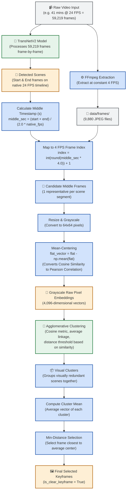

# Frame Extraction to Final Keyframe Pipeline

This flowchart documents the technical pipeline that processes the raw video input, extracts frames, detects scenes, clusters visual segments, and selects the final keyframes displayed on the dashboard.

---

### Step-by-Step Walkthrough

1. **Dual-Path Initialization**:
   - **Path A (Frame Extraction)**: FFmpeg extracts static images at a low frequency of **4 FPS** (`GLOBAL_FPS = 4.0`) to save disk space and computing power.
   - **Path B (Scene Detection)**: The raw video is fed frame-by-frame to **TransNetV2** at its **native rate** (24 FPS) to pinpoint exact scene change boundaries.
2. **Temporal Alignment**:
   - The mid-point of each detected scene (in seconds) is calculated.
   - This timestamp is converted to the nearest 4 FPS frame number to yield a list of **unique candidate frames**.
3. **Preprocessing & Embedding**:
   - Candidates are downscaled to `64x64` pixels and grayscaled.
   - **Mean-centering** is applied to cancel out solid background similarities (e.g. slides with the same layout), ensuring focus on the actual content differences (essentially converting cosine similarity to a Pearson correlation coefficient).
4. **Agglomerative Clustering**:
   - The embeddings are grouped together hierarchical-style based on Cosine Distance. Similar scenes (e.g., slides showing the same slide deck background) are clustered together.
5. **Representative Center Selection**:
   - For each cluster, the algorithm selects the frame that is mathematically closest to the cluster's average center. This acts as the final representative keyframe.
