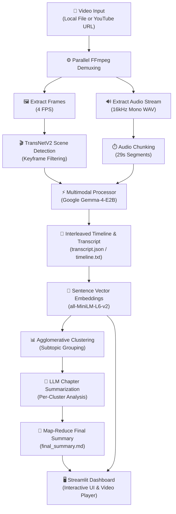

# 🎬 Meiyie — AI-Powered Multimodal Video Summarizer

[](https://www.python.org/downloads/)
[](https://pytorch.org/)
[](https://streamlit.io/)
[](#-license)

**Meiyie** is a local, end-to-end **multimodal video summarization system** that fuses visual scene detection, speech-to-text transcription, semantic topic clustering, and LLM map-reduce summarization into a single automated pipeline — presented through an interactive **Streamlit dashboard**.

---

## 🌟 Key Features

- **🎥 Dual Input Processing**: Accepts local video files (`.mp4`, `.mkv`, `.avi`) or YouTube URLs (via `yt-dlp`).
- **🎬 TransNetV2 Scene Boundary Detection**: Uses a PyTorch neural network to identify visual shot transitions and select optimal keyframes.
- **🔊 29s Audio Chunking & ASR**: Slices audio streams into 29-second segments for high-fidelity speech recognition and multimodal alignment.
- **🤖 Gemma-4 Multimodal Core**: Synthesizes keyframes and audio chunks natively in an interleaved context prompt.
- **🔎 Semantic RAG & Vector Search**: Generates dense vector embeddings (`all-MiniLM-L6-v2`) for semantic search and timeline indexing.
- **📊 Agglomerative Subtopic Clustering**: Automatically groups contiguous timeline events into coherent semantic chapters.
- **📝 Map-Reduce Summarization**: Uses LangChain to synthesize chapter summaries into a final cohesive narrative report.
- **🖥️ Streamlit Interactive UI**: Real-time video player synced to search results, subtopic cards, and overall summary export.
- **🧪 Automated Evaluation Suite**: Evaluates transcription quality (WER/CER), summary fidelity (ROUGE/BLEU/BERTScore), and audio noise robustness.

---

## 📐 Overall Pipeline Architecture



---

## 📁 Repository Directory Structure

```
Meiyie/
├── src/                                  # 🧠 Primary Source Code
│   ├── main.py                          # Master CLI pipeline orchestrator
│   ├── langchain_splitter_chunking.py   # Semantic text splitting logic
│   ├── audio/
│   │   └── transcription.py            # Whisper / Gemma audio transcription
│   ├── preprocessing/
│   │   ├── extract_audio.py            # FFmpeg audio extractor
│   │   ├── extract_frames.py           # FFmpeg frame extractor
│   │   └── frame_filter.py             # TransNetV2 scene detection & frame filter
│   ├── vision/
│   │   └── frame_captioning.py         # BLIP-2 / Gemma VLM frame captioning
│   ├── multimodal/
│   │   └── multimodal_processor.py     # Native interleaved multimodal engine
│   ├── summarization/
│   │   └── summarize.py                # LangChain Map-Reduce LLM summarizer
│   ├── utils/
│   │   ├── cluster_subtopics.py        # Agglomerative semantic clustering
│   │   ├── embed_and_search.py         # Vector embeddings & RAG search
│   │   ├── export_utils.py             # PDF/TXT/JSON export helper
│   │   ├── interleave.py              # Timeline interleaving helper
│   │   └── summarize_clusters.py       # Per-subtopic summarization
│   └── ui/
│       └── app.py                      # Streamlit interactive frontend
│
├── evaluation/                           # 🧪 Benchmark & Evaluation Suite
│   ├── run_experiment.py               # Full evaluation suite runner
│   ├── run_pipeline_on_vtssum.py        # Pipeline runner for VT-SSum dataset
│   ├── run_voice_noise_evaluation.py   # Audio noise evaluation test
│   ├── evaluate_summaries.py           # ROUGE, BLEU, BERTScore metrics
│   ├── evaluate_transcripts.py         # Word Error Rate (WER/CER) metrics
│   └── convert_vtssum.py               # Benchmark dataset converter
│
├── data/                                 # 📂 Benchmark Datasets & Runtime Processing
│   ├── TVSum/                          # 🎬 TVSum50 Dataset (videos/ & annotations/)
│   ├── VT-SSum/                        # 📚 VT-SSum Spoken Lecture Dataset (test/)
│   ├── EDUVSUM/                        # 🎓 EDUVSUM Educational Lectures Dataset
│   ├── Voice_Noise_Test_Set/           # 🔊 Audio Noise Robustness Evaluation Set
│   ├── raw_videos/                     # Default input video folder
│   ├── audio/                          # Extracted WAV audio & 29s chunks
│   ├── frames/                         # Extracted keyframe images
│   └── ocr_text/                       # Saved OCR text extractions
│
├── outputs/                              # 📤 Generated Pipeline Outputs
│   ├── transcript.json                 # Unified transcript file
│   ├── interleaved_timeline.txt        # Chronological visual & speech timeline
│   ├── embeddings.npy                  # Vector embeddings for RAG
│   ├── clustered_subtopics.json        # Subtopic cluster groupings
│   ├── final_topic_summaries.json      # LLM summaries per subtopic
│   └── final_summary.md               # Final cohesive Markdown summary
│
├── transnetv2_pytorch/                   # 🎬 TransNetV2 PyTorch Package
├── Doc/                                  # 📄 Technical Specifications & System Briefs
├── run.bat                               # 🚀 One-Click Windows Launcher Script
├── run_evaluation.bat                    # 🧪 Windows Launcher for Evaluation Suite
├── requirements.txt                      # 📌 Frozen Python Package Dependencies
└── .gitignore                            # 🛡️ Git Exclusion Config (Ignores vts/, archive/, etc.)
```

---

## 📊 Datasets & Storage Structure

All datasets are stored in dedicated subfolders inside the `data/` directory.

### Total Datasets Used: **5 Benchmark Datasets**

| Dataset Name | Subfolder Location | Modality & Description | Total Samples |
|---|---|---|---|
| **9-Video YouTube Benchmark** | `Doc/youtube_9_videos_benchmark.md` | **Multimodal**: 9 YouTube videos across 3 duration tiers (<10m, 10-30m, >=30m) & 3 presentation types evaluated across 4 Batch Sizes (2,8,16,32) & 3 Granularity Modes. | 9 Videos + Benchmark Matrix |
| **TVSum50** | `data/TVSum/` | **Multimodal**: 50 YouTube web videos across 10 event categories with 20 human shot-importance ratings per video. | 50 Videos + Annotations |
| **VT-SSum** | `data/VT-SSum/` | **Spoken Language**: Academic lecture transcripts from VideoLectures.NET across CS, Math, Physics, Medicine, & Social Sciences. | 9,616 Transcripts |
| **EDUVSUM** | `data/EDUVSUM/` | **Educational Lectures**: Video recordings, `.vtt` subtitles, and ground-truth topic chapter annotations. | 97 Educational Videos |
| **Voice Noise Test Set** | `data/Voice_Noise_Test_Set/` | **Audio Noise Benchmark**: Audio samples injected with background noise across varying SNR levels (-5dB to +20dB). | Multi-SNR Audio Set |

---

### Dataset Subfolder Tree Layout:

```
data/
├── TVSum/                                # 🎬 TVSum50 Dataset
│   ├── videos/                           # 50 raw MP4 video clips
│   └── annotations/                      # Ground truth shot importance scores & metadata
│
├── VT-SSum/                              # 📚 VT-SSum Lecture Summarization Dataset
│   └── test/                             # Test set transcript & summary JSON files
│
├── EDUVSUM/                              # 🎓 EDUVSUM Educational Lectures Dataset
│   ├── annotations/                      # Topic segment annotations
│   ├── *.mp4                             # Educational MP4 video files
│   └── *.vtt                             # Subtitle & transcript files
│
├── Voice_Noise_Test_Set/                 # 🔊 Audio Noise Evaluation Test Set
│   └── *.wav                             # Clean and noise-injected audio tracks
│
└── ⚙️ Local Runtime Processing Folders
    ├── raw_videos/                       # Default user video input folder (contains 9-Video YouTube benchmark set)
    ├── audio/                            # Extracted audio tracks & 29s chunks
    ├── frames/                           # Extracted visual keyframes
    └── ocr_text/                         # OCR text extraction outputs
```

---

### 📹 9-Video YouTube Multimodal Benchmark Matrix

The **9-Video YouTube Benchmark Dataset** evaluates system performance across 3 duration tiers and 3 video presentation types:

| Duration Tier | Video Duration | Video Type | Video Title | YouTube URL |
|:---:|:---:|:---:|:---|:---:|
| **Short Form** | `< 10 mins` | Narrative & FPP | How to clean a Laptops Cooling fans! | [Link](https://youtu.be/J1KlRklVGMk?si=-E7NljEmlHB8skfV) |
| **Short Form** | `< 10 mins` | Narrative + Slide | Basic Math Calculus | [Link](https://youtu.be/IFlXeFwA_2A?si=xO1f2ZUL_mK2MgDj) |
| **Short Form** | `< 10 mins` | Presentation & TPP | How Every Child can Thrive by Five | [Link](https://youtu.be/aISXCw0Pi94?si=Uzdd4S6gCHFC1x32) |
| **Medium Form** | `10 – 30 mins` | Narrative & FPP | I Built the Most Powerful Cyberdeck in the World | [Link](https://youtu.be/mwdgtGI5G84?si=cwGFqZIMLx1GOEsM) |
| **Medium Form** | `10 – 30 mins` | Narrative + Slide | Lecture 11.1 – Reasoning in Knowledge Graphs | [Link](https://youtu.be/X9yl0pTP9fY?si=Usz0SZbLErmDi_S_) |
| **Medium Form** | `10 – 30 mins` | Presentation & TPP | AI and human evolution | [Link](https://youtu.be/jt3Ul3rPXaE?si=I_72ly2xroly8xlX) |
| **Long Form** | `>= 30 mins` | Narrative & FPP | The 50 Easiest 3-Ingredient Recipes | [Link](https://youtu.be/WcGYBX6Ucvg?si=jfYFpGtPrnkb2dXV) |
| **Long Form** | `>= 30 mins` | Narrative + Slide | Lecture 10.3 - Knowledge Graph Completion Algorithms | [Link](https://youtu.be/Xm5VrxZYhu4?si=JNSIbmuamUEfwTzB) |
| **Long Form** | `>= 30 mins` | Presentation & TPP | AMD Advancing AI 2026: Lisa Su Full Keynote | [Link](https://www.youtube.com/live/jvtPC28nGsc?si=wH3lNI1VQUP26pk_) |

*For complete benchmark tables detailing Extracted Frames, Processing Time, and VRAM Usage across Batch Sizes (2, 8, 16, 32) and Granularity Modes (Low, Medium, High), see [youtube_9_videos_benchmark.md](file:///c:/Users/admin/Desktop/Meiyie/Doc/youtube_9_videos_benchmark.md).*

---

## ⚙️ Prerequisites & System Requirements

### Hardware Requirements
- **GPU**: NVIDIA GPU with ≥16 GB VRAM recommended (tested on RTX A5500 / RTX 6000 Ada).
- **RAM**: ≥32 GB System RAM.
- **Storage**: ~5 GB for model weights and video frames.

### Software Requirements
- **OS**: Windows 10/11 or Linux (Ubuntu 20.04+)
- **Python**: Version `3.11+`
- **FFmpeg**: Must be installed and accessible on system `PATH`
- **CUDA**: CUDA 12.x compatible drivers
- **Local LLM Backend**: `llama.cpp` / `llama-server` (or TurboQuant) running on `http://localhost:8080` for LLM text summarization steps.

---

## 🚀 Quick Start Guide

### 1. Installation

Clone the repository and install dependencies inside a virtual environment:

```bash
# Clone the repository
git clone https://github.com/your-username/Meiyie.git
cd Meiyie

# Create a virtual environment
python -m venv vts
.\vts\Scripts\activate          # Windows
# source vts/bin/activate       # Linux/macOS

# Install dependencies
pip install -r requirements.txt
```

---

### 2. Running the Pipeline

You can run **Meiyie** in **three ways**:

#### Option A: One-Click Launcher (Windows)
Double-click `run.bat` or execute in terminal:
```cmd
.\run.bat
```
This automatically launches the **Streamlit Web Application** in your browser at `http://localhost:8501`.

---

#### Option B: Streamlit Web UI
Run the frontend dashboard manually:
```bash
streamlit run src/ui/app.py
```
**UI Features**:
- **Video Input**: Upload a local MP4 file or paste a YouTube URL.
- **Overall Summary**: Renders `final_summary.md` with chapter breakdowns.
- **Subtopic Summaries**: View title, description, and key points per subtopic.
- **Semantic Search (RAG)**: Search video content by concept (e.g., *"How to clean fans"*). Clicking a result jumps the video player directly to that timestamp.

---

#### Option C: Command Line Interface (CLI)
Run the pipeline directly from the command line:
```bash
python src/main.py --video_path "data/raw_videos/sample.mp4"
```

**Available CLI Flags**:
```
options:
  -h, --help            Show help message and exit
  --video_path VIDEO_PATH
                        Absolute or relative path to the input video file.
  --threshold THRESHOLD
                        TransNetV2 scene boundary threshold (default: 0.5).
  --similarity_threshold SIMILARITY_THRESHOLD
                        Frame clustering similarity threshold (default: 0.85).
  --use_multimodal {True,False}
                        Enable native interleaved multimodal processing (default: True).
  --batch_size BATCH_SIZE
                        Processing batch size for multimodal processor (default: 4).
```

---

#### Option D: Automated Evaluation Suite
To run benchmark evaluations on dataset test suites (e.g. VT-SSum dataset or noise robustness tests):

```cmd
# Windows Batch Execution
.\run_evaluation.bat

# CLI Execution
python evaluation/run_experiment.py
```

---

## ⚙️ Configuration Reference

Main configuration parameters can be adjusted at the top of `src/main.py`:

| Parameter | Default | Description |
|---|---|---|
| `GLOBAL_FPS` | `4.0` | Extraction frame rate (frames per second). |
| `GLOBAL_AUDIO_CHUNK_SEC` | `29` | Duration of audio chunks (max 30s for Gemma-4). |
| `USE_MULTIMODAL_PROCESSOR` | `True` | `True` = Interleaved Gemma-4 mode, `False` = Separate VLM + ASR. |
| `TURBO_QUANT_PORT` | `8080` | Port for the local `llama.cpp` LLM server backend. |

---

## 📄 Output Files Reference

When the pipeline finishes processing a video, the following artifacts are stored in `outputs/`:

| Output File | Format | Description |
|---|---|---|
| `transcript.json` | JSON | Speech-to-text transcript with start/end timestamps. |
| `interleaved_timeline.txt` | TXT | Combined chronological timeline of speech & keyframe descriptions. |
| `embeddings.npy` | NumPy | Dense vector embeddings used for semantic search. |
| `clustered_subtopics.json` | JSON | Grouped semantic subtopics generated by agglomerative clustering. |
| `final_topic_summaries.json` | JSON | Per-subtopic titles, descriptions, and summaries. |
| `final_summary.md` | Markdown | Final cohesive Map-Reduce summary report. |
| `execution_times.txt` | TXT | Latency and processing time metrics for each stage. |

---

## 📝 License & Citation

This project is created for educational and academic research purposes.

For questions, feedback, or issues, please open an issue in the repository.
# AI-Video-Summarizer-with-Adaptive-Sampling-Mechanism-FYP-

