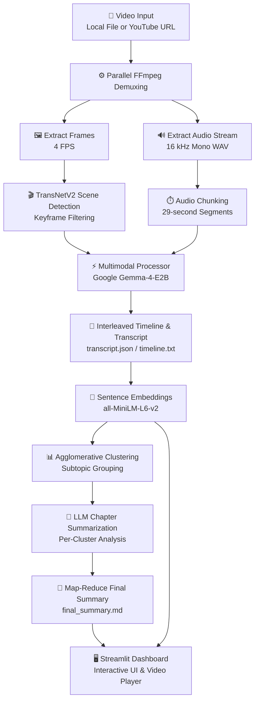

# 🎬 AI-Powered Multimodal Video Summarizer

[](https://www.python.org/downloads/)
[](https://pytorch.org/)
[](https://streamlit.io/)
[](#-license)

**AI Video Summarizer with Adaptive Sampling Mechanism** is a local, end-to-end **multimodal video summarization system** that combines visual scene detection, speech-to-text transcription, semantic topic clustering, and LLM-based Map-Reduce summarization into a single automated pipeline.

The system is controlled through an interactive **Streamlit dashboard** and is designed to process both short and long-form videos while preserving important visual and audio context.

---

## 📌 Table of Contents

* [🌟 Key Features](#-key-features)
* [📐 Pipeline Architecture](#-pipeline-architecture)
* [📁 Repository Directory Structure](#-repository-directory-structure)
* [📊 Datasets & Storage Structure](#-datasets--storage-structure)
* [🚀 Getting Started](#-getting-started)
* [⚙️ Llama Server Configuration](#-llama-server-configuration)

---

## 🌟 Key Features

* **🎥 Dual Input Processing**
  Accepts local video files (`.mp4`, `.mkv`, `.avi`) and YouTube URLs using `yt-dlp`.

* **🎬 TransNetV2 Scene Boundary Detection**
  Detects visual shot transitions and supports keyframe selection through a PyTorch-based scene detection pipeline.

* **🔊 Audio Chunking & ASR**
  Splits extracted audio into 29-second segments for speech recognition and multimodal timeline alignment.

* **🤖 Gemma-4 Multimodal Processing**
  Processes visual keyframes and audio/transcript information within an interleaved multimodal context.

* **🔎 Semantic Search**
  Generates dense vector embeddings using `all-MiniLM-L6-v2` to support semantic search across video content.

* **📊 Agglomerative Subtopic Clustering**
  Groups semantically related timeline segments into coherent subtopics.

* **📝 Map-Reduce Summarization**
  Generates chapter-level summaries before combining them into a final cohesive summary.

* **🖥️ Streamlit Interactive Dashboard**
  Provides video playback, subtopic navigation, semantic search, keyframe visualization, and summary generation.

* **🧪 Evaluation Suite**
  Supports evaluation using WER/CER for speech recognition and ROUGE, BLEU, and BERTScore for summarization quality.

---

## 📐 Pipeline Architecture



---

## 📁 Repository Directory Structure

The repository is organized into separate directories for source code, datasets, evaluation scripts, documentation, and generated outputs.


---

## 📊 Datasets & Storage Structure

Meiyie supports processing and benchmarking across **five integrated datasets and evaluation resources** managed within the project runtime structure.

| Dataset / Resource            | Location                            | Modality & Description                                                                                                                  |           Samples |
| ----------------------------- | ----------------------------------- | --------------------------------------------------------------------------------------------------------------------------------------- | ----------------: |
| **9-Video YouTube Benchmark** | `Doc/youtube_9_videos_benchmark.md` | Multimodal benchmark covering 9 YouTube videos across 3 duration tiers and 3 presentation types, evaluated across multiple batch sizes. |          9 Videos |
| **VT-SSum**                   | `data/VT-SSum/`                     | Spoken-language dataset containing academic lecture transcripts covering Computer Science, Mathematics, Physics, and Medicine.          | 9,616 Transcripts |
| **Voice Noise Test Set**      | `data/Voice_Noise_Test_Set/`        | Audio benchmark containing speech samples with background noise at different signal-to-noise ratios (SNR).                              |         Multi-SNR |

---

## 🚀 Getting Started

### 📦 Installation

#### 1. Clone the repository

Replace `<repository-url>` with the URL of your GitHub repository:

```bash
git clone <repository-url>
cd Meiyie
```

#### 2. Install dependencies

Make sure Python 3.11+ and the required PyTorch version are installed.

```bash
pip install -r requirements.txt
```

---

### 🏃 Running the Application

#### Windows — One-Click Launch

Double-click:

```text
run.bat
```

This launches the system pipeline and Streamlit application.

#### Manual Launch

Start the Streamlit dashboard directly:

```bash
streamlit run src/ui/app.py
```

---

### 🧪 Running Benchmarks

To run the benchmark evaluation suite:

```bash
run_evaluation.bat
```

---

## ⚙️ Llama Server Configuration

The pipeline uses `llama-server` with the quantized Gemma-4-E2B model for local multimodal inference. The following configuration is integrated into `run.bat` and is provided here for reproducibility.

```bash
wsl /home/<username>/llama-cpp-turboquant/build/bin/llama-server \
  -m /mnt/c/Users/<username>/.cache/huggingface/hub/models--unsloth--gemma-4-E2B-it-GGUF/snapshots/<snapshot-id>/gemma-4-E2B-it-Q4_K_M.gguf \
  --cache-type-k turbo3 \
  --cache-type-v turbo3 \
  --host 0.0.0.0 \
  --port 8080 \
  -c 32768 \
  -ngl 99 \
  -fa on
