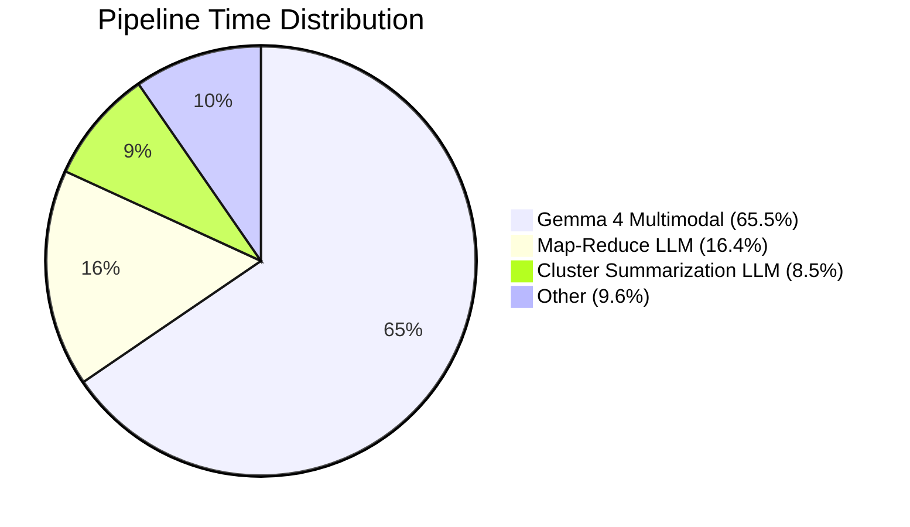

# Speed Optimization Analysis: Merging Embedding Models in Meiyie

## Your Current Pipeline Time Breakdown

Based on [execution_times.txt](file:///c:/Users/admin_mtds/OneDrive/Desktop/Meiyie/outputs/execution_times.txt):

| Step | Time | % of Total |
|------|------|------------|
| 4 & 5. Native Multimodal Processing (Gemma 4) | **165.03s** | **65.5%** |
| 10. Final Map-Reduce Summary (LLM) | 41.25s | 16.4% |
| 9. Summarize Clusters (LLM) | 21.49s | 8.5% |
| 3. Compute Frame Diffs (TransNetV2) | 8.48s | 3.4% |
| **7. Embed and Search (all-MiniLM-L6-v2)** | **5.81s** | **2.3%** |
| 1. Extract Frames | 5.47s | 2.2% |
| 3.5. Chunk Audio | 2.23s | 0.9% |
| 2. Extract Audio | 2.21s | 0.9% |
| 8. Cluster Subtopics (K-Means) | 0.06s | 0.0% |
| 6. Adapt Output | 0.02s | 0.0% |
| **TOTAL** | **252.05s** | **100%** |

---

## Honest Answer: Will Merging Embedding Models Improve Speed?

### Short answer: **No — embedding is not your bottleneck.**

Your embedding step (Step 7) takes only **5.81 seconds** — that's **2.3% of total pipeline time**. Even if you cut that step to zero, you'd save less than 6 seconds on a 252-second pipeline.

Embedding models are used in **two places** in your pipeline:

1. **Step 7** — `embed_and_search.py` → `all-MiniLM-L6-v2` (sentence-transformers) → **5.81s**
2. **Step 10** — `summarize.py` → `HuggingFaceEmbeddings("all-MiniLM-L6-v2")` for `SemanticChunker` → already included in the 41.25s

The embedding portion within Step 10 is likely only ~1-2 seconds (the rest is LLM inference). So total embedding time across your entire pipeline is roughly **~7 seconds out of 252**.

### What "merging embedding models" would mean:

| Approach | Speed Impact | Quality Impact |
|----------|-------------|----------------|
| Reuse the same model instance across Steps 7 & 10 | ⚡ Save ~2s (model load) | ✅ None — same model |
| Switch to a faster model (e.g. `e5-small`) | ⚡ Save ~1-2s | ⚠️ Slightly worse clustering |
| Use a larger model (e.g. `bge-large`) | 🐌 Slower by ~3-5s | ✅ Better clustering quality |
| Concatenate embeddings from multiple models | 🐌 Much slower | ❓ Unpredictable quality |
| Use Gemma 4's embeddings for clustering too | 🐌 Extremely slow | ✅ Richer semantics, but overkill |

> [!IMPORTANT]
> **Merging or ensembling embedding models will make your pipeline SLOWER, not faster.** The embedding step is already negligible. Your real bottleneck is LLM inference.

---

## Where Your Time Actually Goes



**90.4% of your pipeline time is LLM inference** — either Gemma 4 for multimodal processing, or TurboQuant for summarization.

---

## What Would ACTUALLY Improve Your Speed

Ranked by impact, here are the strategies that would make a real difference:

### 🥇 1. Optimize Multimodal Processing (saves 60-100+ seconds)

The Gemma 4 native multimodal processor takes **165 seconds** and processes chunks **sequentially**. Options:

- **Reduce keyframes per chunk**: You already cap at 5, but try 3 — each fewer image saves encoding time
- **Lower `max_new_tokens`** from 2000 → 500-800 (your analyses likely don't need 2000 tokens)
- **Use `torch.compile()`** on the model for faster generation
- **Use Flash Attention 2** if not already enabled: `model = AutoModelForMultimodalLM.from_pretrained(..., attn_implementation="flash_attention_2")`
- **Batch consecutive audio-only chunks** (chunks with 0 frames) together

### 🥈 2. Merge Steps 9 & 10 into a Single LLM Pass (saves ~20-40 seconds)

Currently you run:
- Step 9: LLM summarizes each cluster → **21.49s**  
- Step 10: LLM map-reduces the timeline → **41.25s**

These are **two separate multi-call LLM workflows**. You could combine them into a single pass by feeding clustered context directly into the Map-Reduce chain, eliminating the per-cluster LLM call overhead.

### 🥉 3. Reuse Embedding Model Instance (saves ~2-3 seconds)

Currently `all-MiniLM-L6-v2` is loaded **twice** (Step 7 and Step 10). Cache it:

```python
# In main.py — load once, pass to both steps
from sentence_transformers import SentenceTransformer
model = SentenceTransformer('all-MiniLM-L6-v2', device='cuda')
embed_and_search(model=model)
# ... later ...
summarize_video(embedding_model=model)
```

This is the closest thing to "merging embeddings" that actually helps — but it saves only ~2-3 seconds.

### 4. Use vLLM or TensorRT-LLM for Serving (saves ~30-50% on LLM steps)

Your existing [implementation plan](file:///c:/Users/admin_mtds/OneDrive/Desktop/Meiyie/src/implementation_plan%20%28improve%20speed%29) already mentions this. vLLM with continuous batching + PagedAttention would dramatically speed up Steps 9 & 10.

---

## Summary

| Strategy | Time Saved | Effort |
|----------|-----------|--------|
| Flash Attention + reduce `max_new_tokens` in Gemma 4 | ~40-80s | Low |
| Merge Steps 9 & 10 LLM passes | ~20-40s | Medium |
| Switch to vLLM backend for summarization | ~20-30s | High |
| Reuse embedding model instance (avoid double-load) | ~2-3s | Very Low |
| Merge/ensemble embedding models | ~0s (likely negative) | N/A |

> [!TIP]
> **Best quick win:** Add `attn_implementation="flash_attention_2"` to your Gemma 4 model loading in [multimodal_processor.py](file:///c:/Users/admin_mtds/OneDrive/Desktop/Meiyie/src/multimodal/multimodal_processor.py#L25-L29) and reduce `max_new_tokens` from 2000 to 800. This alone could save 40-80 seconds with minimal code changes.

Let me know which optimization direction you'd like to pursue and I'll implement it!
