# Multimodal Video Summarization: Performance Validation Report

This report presents the validation results of benchmarking **Mode A (Sequential / Native Interleaved)** against **Mode B (Parallel VLM + ASR)** on the local workstation (NVIDIA RTX A5500 GPU + Intel Xeon CPU).

The benchmark was executed using the local virtual environment `(vts)` on a standard 6.75-minute PowerPoint video tutorial (`How to Make a Video in PowerPoint - ppt to video.mp4`, 404.8s).

---

## Performance Summary

| Parameter | Mode A: Sequential / Native Interleaved | Mode B: Parallel VLM + ASR | Difference / Improvement |
|:---|:---|:---|:---|
| **Configuration** | `USE_MULTIMODAL_PROCESSOR = True` | `USE_MULTIMODAL_PROCESSOR = False` | - |
| **ASR & VLM Concurrency** | Sequential (modality after modality) | Concurrent (Python `ProcessPoolExecutor`) | - |
| **ASR & VLM Duration** | 161.37 seconds | **65.50 seconds** | ⚡ **59.41% faster** (~2.46x speedup) |
| **Embed & Search Duration** | 15.66 seconds | **1.48 seconds** | ⚡ **90.55% faster** |
| **Summarize Clusters** | 21.51 seconds | **8.73 seconds** | ⚡ **59.41% faster** |
| **Final Video Summary** | 60.34 seconds | **19.34 seconds** | ⚡ **67.95% faster** |
| **Total Pipeline Duration** | 270.97 seconds (~4.52 mins) | **102.49 seconds** (~1.71 mins) | ⚡ **62.17% overall time savings** |

> [!IMPORTANT]
> Mode B achieved a **62.17% overall time reduction** for the entire pipeline, completing the 6.75-minute video analysis in just **102.49 seconds** compared to **270.97 seconds** in Mode A.

---

## Detailed Step-by-Step Breakdown

```mermaid
gantt
    title Pipeline Step Comparison (Mode A vs Mode B)
    dateFormat  X
    axisFormat %s
    
    section Mode A (Sequential)
    Preprocessing Steps (1-3.5)      :active, a1, 0, 11
    Native Multimodal Proc (4 & 5)   :active, a2, 11, 172
    Clustering & Embed (7-8)         :active, a3, 172, 189
    Summarize Clusters (9)          :active, a4, 189, 211
    Final Summary (10)              :active, a5, 211, 271

    section Mode B (Parallel)
    Preprocessing Steps (1-3.5)      :crit, b1, 0, 11
    Parallel ASR & VLM (4 & 5)       :crit, b2, 11, 76
    Clustering & Embed (7-8)         :crit, b3, 76, 78
    Summarize Clusters (9)          :crit, b4, 78, 87
    Final Summary (10)              :crit, b5, 87, 102
```

### 1. Preprocessing Steps (1, 2, 3, 3.5)
- **Mode A Duration:** 10.59 seconds
- **Mode B Duration:** 11.39 seconds
- **Observations:** Frame extraction (ffmpeg), audio extraction (ffmpeg), scene boundary detection (TransNetV2), and audio chunking perform identically across both modes.

### 2. Transcription & Multimodal Processing (4 & 5)
- **Mode A (Native Interleaved):** 161.37 seconds
- **Mode B (Parallel VLM & ASR):** 65.50 seconds
- **Technical Breakdown:** 
  - **Mode A** processes the video segments sequentially. Since the audio wav files and images are loaded and processed jointly, there is substantial prompt template overhead in the Hugging Face `transformers` environment.
  - **Mode B** runs VLM (frame captioning) and ASR (audio transcription) simultaneously in separate OS processes using `ProcessPoolExecutor` with `max_workers=2`. This maximizes CUDA core usage on the RTX A5500 and Xeon CPU threads.

### 3. Downstream Clustering & LLM Summarization (7, 8, 9, 10)
- **Mode A Duration:** 99.01 seconds
- **Mode B Duration:** 29.60 seconds
- **Technical Breakdown:**
  - In **Mode B**, OS process termination for the VLM/ASR scripts instantly and fully reclaims 100% of their VRAM, leaving a completely clean GPU environment for the llama-server summarization tasks.
  - In **Mode A**, model layers and PyTorch CUDA caches remain partially allocated in the parent process, causing VRAM fragmentation and higher latency for the `llama-server` during API calls.
  - The llama-server prompt cache is also warmer and more efficient in Mode B due to clean context allocation.

---

## Architectural Validation Conclusions

1. **WSL CUDA Integration:** Verified that `llama-server` compiled with CUDA support in the WSL path `/home/admin_mtds/llama-cpp-turboquant/build/bin/llama-server` successfully detects the RTX A5500 and leverages GPU acceleration for summarization.
2. **Speed Savings Claim:** The proposed method document claimed a **~31% speedup** on a 10-minute video. Our benchmark on a 6.75-minute video demonstrated an even greater **62.17% overall speedup** (with a **59.41% speedup** specifically in the transcription phase).
3. **Quantization Precision:** Executing in `bfloat16` precision inside the parallel processes successfully avoids the hallucination loops and context loss that were observed in 4-bit quantized NF4 execution.
