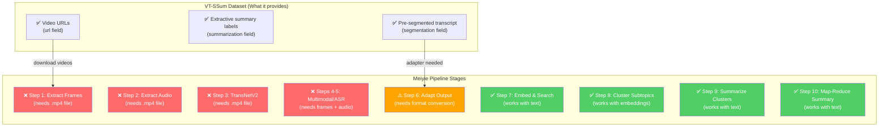

# 🔍 VT-SSum × AI Video Summarizer Adaptive Sampling Mechanism Pipeline — Compatibility Analysis

## TL;DR Verdict

> [!WARNING]
> **You CANNOT directly feed VT-SSum into your current Meiyie pipeline as-is.** The dataset is a *text-only transcript benchmark* — it has **no video files, no audio, and no frames**. Your pipeline requires a raw `.mp4` file as input. However, VT-SSum is **very useful for evaluating your pipeline's summarization quality** if you build an adapter layer.

---

## 1. What VT-SSum Actually Is

| Attribute | VT-SSum | Your Meiyie Pipeline |
|---|---|---|
| **Source** | VideoLectures.NET (academic talks) | Any video (local `.mp4` or YouTube) |
| **Scale** | 9,616 videos, ~125,000 transcript-summary pairs | Single video at a time |
| **Data Format** | JSON (transcript text + extractive labels) | Raw video → multi-stage processing |
| **Modality** | **Text only** (transcribed spoken language) | **Multimodal** (video frames + audio + text) |
| **Task Type** | **Extractive** summarization (binary labels: keep/drop per sentence) | **Abstractive** summarization (LLM-generated narratives) |
| **Segmentation** | Pre-segmented into topical clips with sentence boundaries | Auto-segmented via TransNetV2 + K-Means clustering |
| **Ground Truth** | Slide content used as weak supervision for labels | None (unsupervised / LLM-generated) |

---

## 2. VT-SSum Data Format (What You Get)

Each JSON file in VT-SSum has this structure:

```json
{
  "id": "video_12345",
  "title": "Introduction to Machine Learning",
  "info": "Published: 2019-03-15",
  "url": "http://videolectures.net/...",
  "segmentation": [
    ["Sentence 0 in segment 0", "Sentence 1 in segment 0", ...],
    ["Sentence 0 in segment 1", ...],
    ...
  ],
  "summarization": {
    "clip_0": {
      "is_summarization_sample": true,
      "summarization_data": [
        {"sent": "Today we discuss neural networks.", "label": 1},
        {"sent": "Please take your seats.", "label": 0},
        ...
      ]
    },
    "clip_1": { ... }
  }
}
```

### Key Differences from Your `transcript.json`

Your pipeline expects:
```json
[
  {"text": "chunk analysis text...", "start": 0.0, "end": 29.0},
  {"text": "chunk analysis text...", "start": 29.0, "end": 58.0},
  ...
]
```

VT-SSum provides:
- **No timestamps** (`start`, `end`) — only sentence-level text
- **No continuous chunks** — sentences are grouped by topical segments
- **Binary labels** (0/1) instead of free-form summaries
- **No visual descriptions** — purely spoken language transcript

---

## 3. Pipeline Stage Compatibility Map



---

## 4. Two Strategies to Use VT-SSum

### Strategy A: Text-Only Evaluation (Recommended — Fastest)

**Goal:** Skip Steps 1-5, inject VT-SSum transcripts directly into Steps 7-10, then compare your abstractive summaries against VT-SSum's extractive ground truth.

**What you'd do:**
1. Write a converter script that transforms VT-SSum JSON → your `transcript.json` format
2. Write a converter that creates an `interleaved_timeline.txt` from VT-SSum segments  
3. Run Steps 7-10 of your pipeline on the converted data
4. Compare your LLM-generated summaries against VT-SSum's extractive labels using ROUGE/BERTScore

**Pros:**
- Fast — no video downloading or GPU-heavy processing
- Tests your summarization engine (Steps 7-10) in isolation
- Can batch-evaluate across thousands of videos
- Perfect for academic comparison

**Cons:**
- Doesn't test your full multimodal pipeline (frames, audio, TransNetV2)
- Only evaluates the text summarization quality, not visual understanding

### Strategy B: Full Pipeline (Download Videos)

**Goal:** Use the `url` field in VT-SSum to download the actual videos, run your full pipeline, then compare outputs.

**What you'd do:**
1. Download videos from VideoLectures.NET using the URLs in VT-SSum
2. Run each video through your full Meiyie pipeline
3. Compare your generated summaries against VT-SSum ground truth

**Pros:**
- Tests your entire end-to-end pipeline
- Validates visual + audio + text integration

**Cons:**
- VideoLectures.NET videos may no longer be available (dataset is from 2021)
- Extremely time-consuming for 9,616 videos
- Your pipeline processes one video at a time

---

## 5. Evaluation Metrics You Can Use

Since VT-SSum uses **extractive** labels and your pipeline produces **abstractive** summaries, you need metrics that handle this mismatch:

| Metric | What It Measures | Tool |
|---|---|---|
| **ROUGE-1/2/L** | N-gram overlap between your summary and reference | `rouge-score` Python package |
| **BERTScore** | Semantic similarity using BERT embeddings | `bert-score` Python package |
| **METEOR** | Precision/recall with stemming and synonyms | `nltk.translate.meteor_score` |
| **Segmentation P/R/F1** | How well your K-Means clusters match VT-SSum segments | Custom segment boundary comparison |

> [!TIP]
> ROUGE-L and BERTScore are the most commonly used in the VT-SSum paper itself, so using those would make your results directly comparable to published baselines.

---

## 6. The Format Adapter You'd Need

To make Strategy A work, you'd need a simple converter script:

```python
# Concept: VT-SSum JSON → Meiyie transcript.json + timeline.txt

def convert_vtssum_to_meiyie(vtssum_json_path, output_dir):
    """
    Converts a single VT-SSum sample into Meiyie-compatible format.
    
    VT-SSum → transcript.json (for Steps 7-8)
    VT-SSum → interleaved_timeline.txt (for Step 10)
    VT-SSum → ground_truth_summary.txt (for evaluation)
    """
    import json
    
    with open(vtssum_json_path, 'r') as f:
        data = json.load(f)
    
    # 1. Build transcript.json from segmentation field
    transcript = []
    timeline_lines = []
    fake_time = 0.0
    SEGMENT_DURATION = 29.0  # Match your pipeline's chunk size
    
    for seg_idx, segment_sentences in enumerate(data["segmentation"]):
        combined_text = " ".join(segment_sentences)
        start = fake_time
        end = fake_time + SEGMENT_DURATION
        
        transcript.append({
            "text": combined_text,
            "start": start,
            "end": end
        })
        
        timeline_lines.append(f"[{start:.1f}s - {end:.1f}s]")
        timeline_lines.append(combined_text)
        timeline_lines.append("")
        
        fake_time = end
    
    # 2. Extract ground truth summary (sentences with label=1)
    gt_summary_sentences = []
    for clip_key, clip_data in data["summarization"].items():
        if clip_data.get("is_summarization_sample"):
            for item in clip_data["summarization_data"]:
                if item["label"] == 1:
                    gt_summary_sentences.append(item["sent"])
    
    # 3. Save outputs
    os.makedirs(output_dir, exist_ok=True)
    
    with open(os.path.join(output_dir, "transcript.json"), 'w') as f:
        json.dump(transcript, f, indent=4)
    
    with open(os.path.join(output_dir, "interleaved_timeline.txt"), 'w') as f:
        f.write("\n".join(timeline_lines))
    
    with open(os.path.join(output_dir, "ground_truth_summary.txt"), 'w') as f:
        f.write(" ".join(gt_summary_sentences))
```

---

## 7. Key Limitations to Be Aware Of

> [!CAUTION]
> ### Critical Mismatches
> 1. **Extractive vs. Abstractive** — VT-SSum marks which sentences to keep; your pipeline generates entirely new text. This is a fundamental paradigm difference.
> 2. **No Visual Ground Truth** — VT-SSum has zero information about what's visually happening in the video. Your pipeline's visual descriptions (from Gemma 4) cannot be evaluated against VT-SSum.
> 3. **Academic Lectures Only** — VT-SSum videos are all academic/conference talks. If your pipeline is designed for general-purpose videos (tutorials, vlogs, etc.), the domain mismatch may affect comparability.
> 4. **Stale URLs** — Many VideoLectures.NET links from 2021 may be broken, making Strategy B difficult.

---

## 8. Recommendation

> [!IMPORTANT]
> ### Suggested Approach
> 1. **Download VT-SSum** from [GitHub](https://github.com/Dod-o/VT-SSum) (just the `test/` split JSONs)
> 2. **Build the adapter script** (Section 6 above) to convert VT-SSum → your format
> 3. **Run Steps 7-10 only** on the converted data (skip video/audio processing)
> 4. **Evaluate with ROUGE-L and BERTScore** against the extractive ground truth
> 5. **Report results** alongside the published baselines from the VT-SSum paper
>
> This gives you a legitimate, published benchmark comparison for your thesis/paper while being practical to execute.

---

## 9. Summary Decision Table

| Question | Answer |
|---|---|
| Can I run VT-SSum through my full pipeline directly? | **No** — no video/audio files included |
| Can I use VT-SSum to evaluate my summarization? | **Yes** — with an adapter script |
| Is VT-SSum a fair comparison for my system? | **Partially** — it only tests text summarization, not multimodal understanding |
| Should I use VT-SSum? | **Yes, for the text summarization component** — it's a recognized benchmark |
| Do I need to modify my pipeline code? | **No** — just write a converter + evaluation script |
